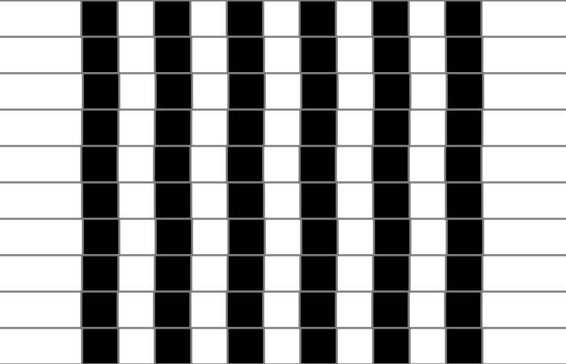

  

# 🌈 Processing Optical Illusion  
*Hypnotic, mind-bending visuals created with [Processing](https://processing.org/). Explore the science of perception through code.*  

 *(Replace with actual demo footage)*  

## 🔮 About  
**Processing Optical Illusion** is a collection of generative visual illusions that play with human perception. Each sketch explores:  
- **Motion illusions** (e.g., peripheral drift, rotating snakes)  
- **Geometric paradoxes** (impossible shapes, Moiré patterns)  
- **Color & contrast tricks** (afterimages, luminance gradients)  
